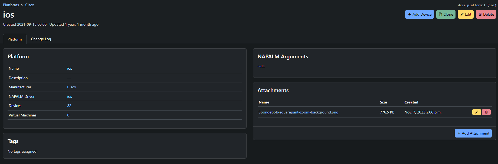
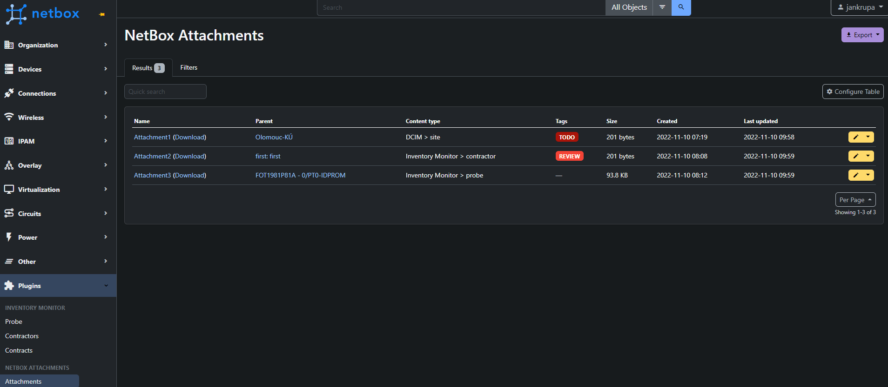
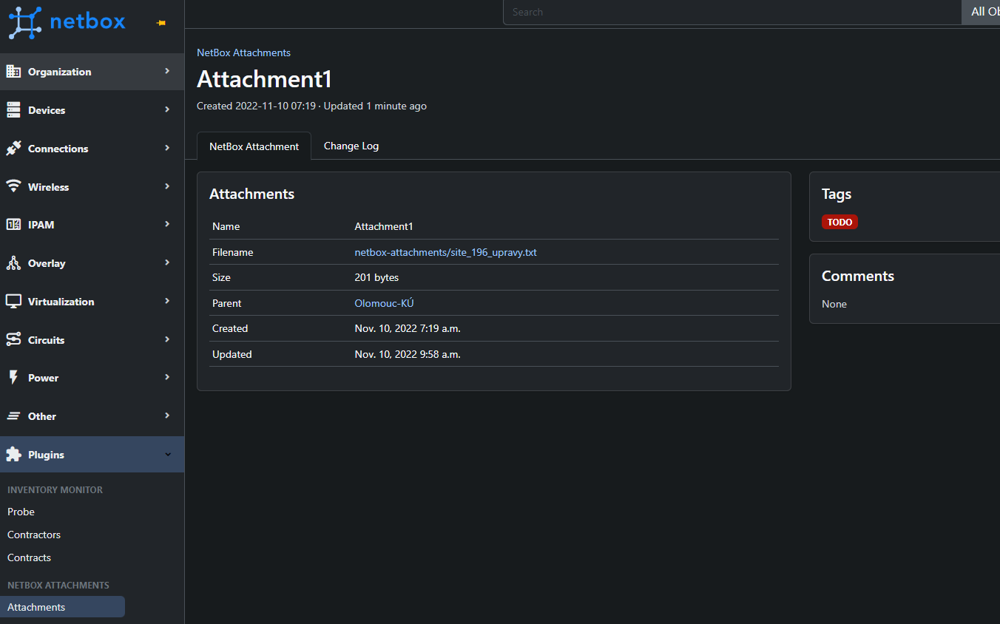

# NetBox Attachments Plugin

[Netbox](https://github.com/netbox-community/netbox) plugin for attaching files to any model.

## Features

This plugin provide following Models:

- NetBoxAttachment

## Compatibility

| Netbox   | Plugin   |
| -------- | -------- |
| >= 3.3.4 | >= 0.0.5 |
|          |          |

## Installation

The plugin is available as a Python package in pypi and can be installed with pip

```
pip install netbox-attachments
```

Enable the plugin in `configuration.py`:

```
PLUGINS = ['netbox_attachments']
```

Restart NetBox and add `netbox-attachments` to your local_requirements.txt

See [NetBox Documentation](https://docs.netbox.dev/en/stable/plugins/#installing-plugins) for details

## Configuration

The following options are available:

- `apps`:
  - **Type**: List
  - **Default**: ['dcim', 'ipam', 'circuits', 'tenancy', 'virtualization', 'wireless']
  - **Description**: Display `Attachments` feature on all models definded under the app label. Attachmets are displayed on `right_page` of the detail-view of model.
- `display_default`:
  - **Type**: String
  - **Default**: "right_page"
  - **Options**: "left_page", "right_page", "full_width_page"
  - **Description**: Setup default setting of where attachments should be displayed under the models
- `display_setting`:
  - **Type**: Dict
  - **Default**: {}
  - **Options**: {<app_label.model>: <prefeered_display>}
  - **Example**: {'dcim.devicerole': 'full_width_page', 'dcim.device': 'left_page', 'ipam.vlan': 'right_page'}
  - **Description**: Set display setting for concrete model
  - **Tip**: Proper `app_label` and `model` names could be found at API `<your_netbox_url>/api/extras/content-types/`

### Configuration Example:

```
PLUGINS_CONFIG = {
    'netbox_attachments': {
        'apps': ['dcim', 'ipam', 'circuits', 'tenancy', 'virtualization', 'wireless', 'inventory_monitor'],
        'display_default': "right_page",
        'display_setting': {'ipam.vlan': "left_page", 'dcim.device': "full_width_page", 'dcim.devicerole': "full_width_page", 'inventory_monitor.probe': "right_page"}
    }
}
```

## Enable Attachments for custom plugin (models)

- Append your plugin to configuration list
  - `apps`: ['<plugin_name>']
- Extend detail templates
  - ```
      # At the TOP
      
      # Under a comments section
      
      # add the left_page and full_width for future extension
    ```
  * Example (device - core model):
    - [load](https://github.com/netbox-community/netbox/blob/c1b7f09530f0293d0f053b8930539b1d174cd03b/netbox/templates/dcim/device.html#L6)
    - [left_page](https://github.com/netbox-community/netbox/blob/c1b7f09530f0293d0f053b8930539b1d174cd03b/netbox/templates/dcim/device.html#L149)
    - [right_page](https://github.com/netbox-community/netbox/blob/c1b7f09530f0293d0f053b8930539b1d174cd03b/netbox/templates/dcim/device.html#L288)
    - [full_with_page](https://github.com/netbox-community/netbox/blob/c1b7f09530f0293d0f053b8930539b1d174cd03b/netbox/templates/dcim/device.html#L293)

## Screenshots

- Model View
  
- List View
  
- Detail View
  
