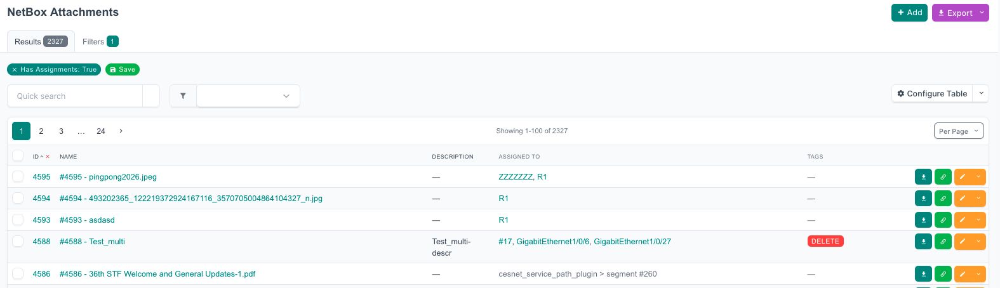
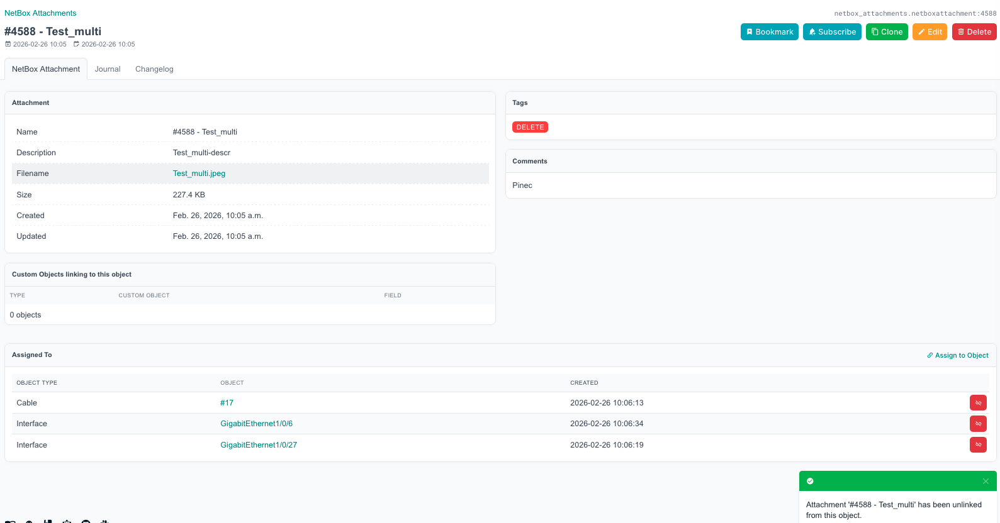
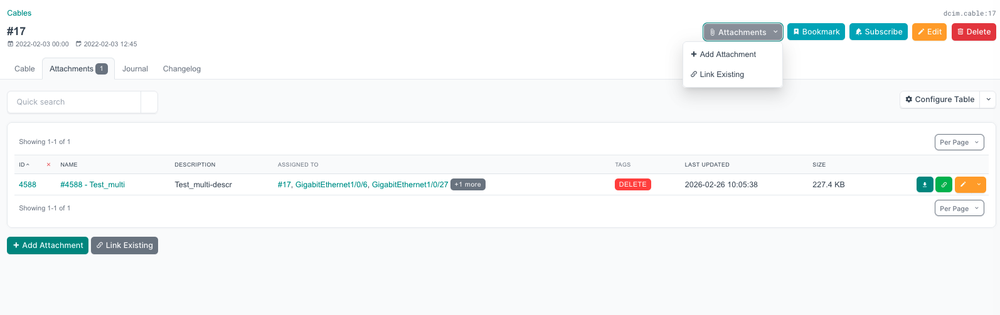
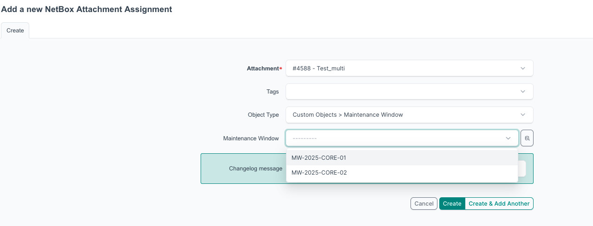

# NetBox Attachments Plugin

[NetBox](https://github.com/netbox-community/netbox) plugin for attaching files to NetBox objects.

## Overview

`netbox-attachments` adds an attachment model and UI/API workflows to upload, link, and manage files against NetBox models.

- Project documentation: [docs/index.md](docs/index.md)
- Installation guide: [docs/installation.md](docs/installation.md)
- Configuration reference: [docs/configuration.md](docs/configuration.md)
- Usage guide: [docs/usage.md](docs/usage.md)
- Compatibility policy: [docs/compatibility.md](docs/compatibility.md)
- Release process: [docs/release-process.md](docs/release-process.md)

## Compatibility

Supported now:

- NetBox: `4.5.x`
- Plugin: `11.x`
- Python: `3.12`, `3.13`, `3.14`

Compatibility details and legacy version notes are documented in [docs/compatibility.md](docs/compatibility.md).

## Installation

Install from PyPI:

```bash
pip install netbox-attachments
```

Enable the plugin in `configuration.py`:

```python
PLUGINS = ["netbox_attachments"]
```

Create storage directory and set permissions:

```bash
mkdir -p /opt/netbox/netbox/media/netbox-attachments
chown netbox /opt/netbox/netbox/media/netbox-attachments
```

Run migrations:

```bash
python3 manage.py migrate netbox_attachments
```

Full installation details: [docs/installation.md](docs/installation.md).

## Configuration

Plugin settings are configured via `PLUGINS_CONFIG["netbox_attachments"]`.

```python
PLUGINS_CONFIG = {
    "netbox_attachments": {
        "applied_scope": "model",
        "scope_filter": ["dcim.device", "ipam.prefix", "tenancy"],
        "display_default": "right_page",
        "create_add_button": True,  # show top "Attachments" dropdown in additional_tab mode
        "display_setting": {"ipam.vlan": "left_page"},
    }
}
```

Complete settings reference: [docs/configuration.md](docs/configuration.md).

## API

Attachment APIs are exposed under:

- `/api/plugins/netbox-attachments/netbox-attachments/`
- `/api/plugins/netbox-attachments/netbox-attachment-assignments/`

Workflow:

1. Upload/create attachment via `netbox-attachments`.
2. Link it to an object via `netbox-attachment-assignments`.

Additional usage details: [docs/usage.md](docs/usage.md).

## Testing

Primary local command:

```bash
make test
```

Packaging check:

```bash
python -m build
```

## Support

- Bug reports and feature requests: [GitHub Issues](https://github.com/Kani999/netbox-attachments/issues)
- NetBox community support: [NetDev Community Slack](https://netdev.chat/) and [GitHub Discussions in netbox-community](https://github.com/netbox-community/netbox/discussions)

## Contributing

Contribution workflow and expectations are documented in [CONTRIBUTING.md](CONTRIBUTING.md).

## Release Notes

Project release history follows Keep a Changelog:

- [CHANGELOG.md](CHANGELOG.md)

## Screenshots

- **Attachment List**
  
- **Attachment Detail**
  
- **Object Attachments Tab**
  
- **Create Assignment**
  

## License

Licensed under Apache 2.0. See [LICENSE](LICENSE).
